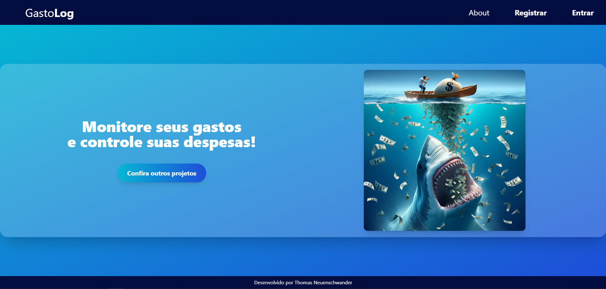
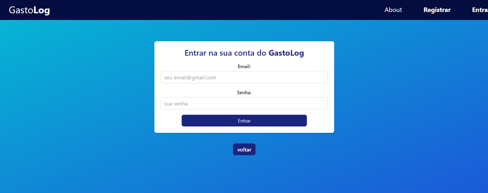
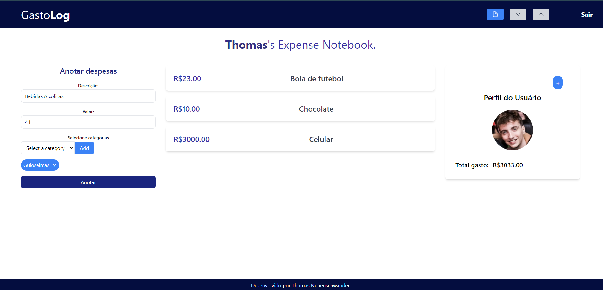
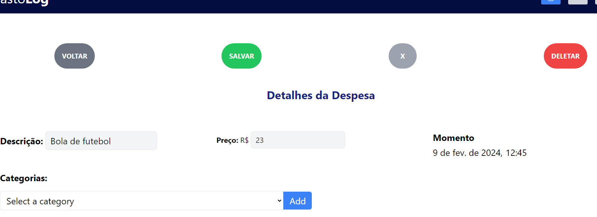
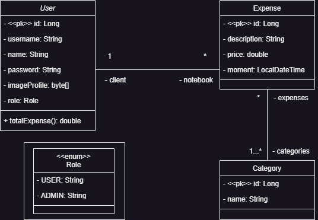

# GastoLog

# Sobre o projeto

GastoLog é uma aplicação full stack web construída com o propósito de aprimorar e praticar minhas habilidades de desenvolvimento, bem como as tecnologias utilizadas.

A aplicação consiste em um caderno de despesas, onde os usarios conseguem anotar seus gastos.

## Layout






## Modelo conceitual


# Tecnologias utilizadas
## Back end
- Java
- Spring Boot
- JPA / Hibernate
- Maven
- JJWT
## Front end
- React (Vite)
- TypeScript
- TailwindCSS


# Como executar o projeto
 Fazer download do projeto
## Pré-requisitos: 
* Java 17
* NodeJs
### Backend

```bash
# entrar no diretório do projeto
# entrar no diretório da API
cd GastoLog/GastoLog

# executar o projeto
mvn spring-boot:run
```

### Frontend web
Pré-requisitos: npm / yarn

```bash
# entrar no diretório do projeto
# entrar no diretório do frontend
cd GastoLog/frontend

# instalar dependências
npm i

# executar o projeto
npm run dev
```

# Autor

Thomas Neuenschwander,
[Linkedin](https://www.linkedin.com/in/thomas-neuenschwander-87a568267/).
thom.nmaciel.baron@gmail.com.

